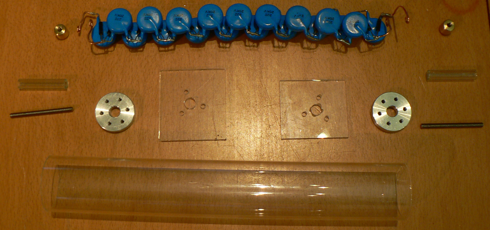
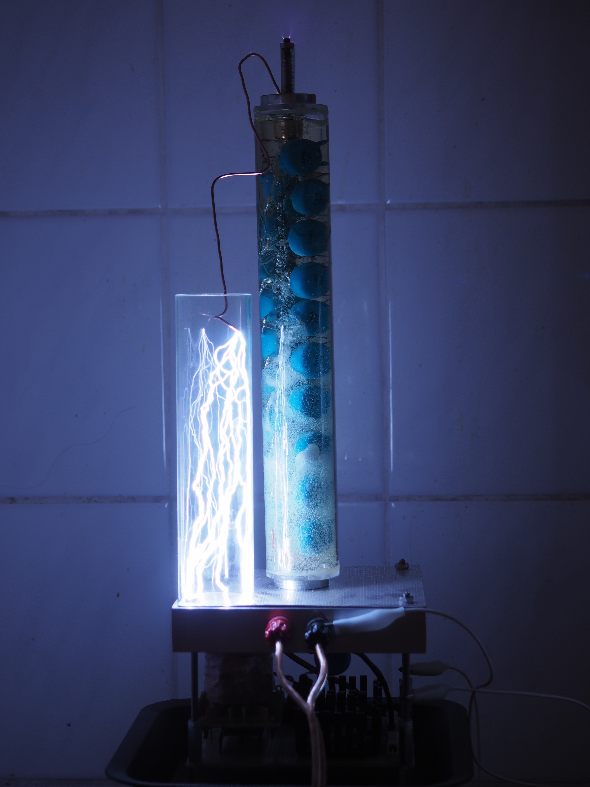

## 40kV Cascade

The first high voltage cascade was build by using 10nF 2kV capacitors and a series of 3 1N4007 rectifiers in series.
It has 20 stages resulting in a maximum output voltage of 20kV.
To ensure an evenen voltage distribution between the rectifiers, a voltage divider with 10M resistors is added in parallel.
This has also the advantage, that the cascade will discharge quickly when it is powerd off.
For every stage corona rings were added, even if they are not necessarry at these voltages.

The driver was based using the core of a old flyback transformer, with self winded primary and secondary coils.
It was powered by 2N3055 feedback circuit.

## 200kV Cascade

The second Cascade was build using 20kV 100pF capacitors and 20kV rectifiers, thus resulting in a maximum output voltage of 200kV.
As un such high voltages, corona discharges become a significant problem, the cascade was encapsulated in epoxy.
The complete assembly was put in a 4cm glass tube and both ends are sealed with acrylic glass.
Terminals for ground and hv output are made from aluminum discs with threads for mounting on the driver base.
To provide the AC to power the cascade, electrical feedthroughs are mad of M4 threaded rod and glass tubings.

As I did not provide any cooling a lots of bubbles build up in the epoxy and the galass tube cracked.
This is no practical issue and gives the cascade an interesting look.

The first driver was based on the same circuit as the 40kV one but on high loads, the transistors failed within seconds.
The main problem was probably the too small cooling fins, even though some powerfull discharges could be acchieved.

## 200kV Cascade Driver Update

The new driver for the Cascade was based on the ZVS circuit using IRFZ44N which can handle 49A @ 55V.
As the FETs have a RDS of only 17mOhm they dissipate less heat than the 2N3055 transistors.
At 12V the dirver draws up to 11A without any problems.
