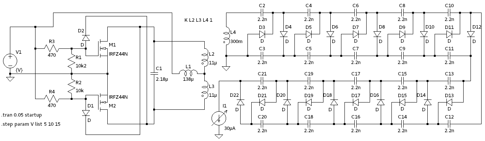

## 40kV Cascade

The first high voltage cascade was build by using 10nF 2kV capacitors and a series of 3 1N4007 rectifiers in series.
It has 20 stages resulting in a maximum output voltage of 40kV.
To ensure an even voltage distribution between the rectifiers, a voltage divider with 10M resistors is added in parallel.
This has also the advantage, that the cascade will discharge quickly when it is powered off.
For every stage, corona rings were added, even if they are not necessary at these voltages.

The driver was based using the ferrite core of an old flyback transformer, with self-winded primary and secondary coils.
It was powered by the common 2N3055 feedback circuit.
Even though the circuit is fairly simple, it is quite hard to simulate with a cascade as a load.
The feedback of L2 is not only influenced by L1, but also by the load of L3.
This causes LT-Spice to decrease the step width until it crashes.

## 200kV Cascade

The second cascade was build using 20kV 2.2nF capacitors and 20kV rectifiers, thus resulting in a maximum output voltage of 200kV.
At such high voltages, corona discharges become a significant problem.
Therefore, the <a class="imgTooltip" href="images/cascade-ii-preassembly.jpg">assembly</a> was put in a 4cm glass tube, filled with epoxy and both ends are sealed with acrylic glass.
Terminals for ground and high voltage output are made from aluminum discs with threads for mounting on the driver base.
To provide the AC to power the cascade, electrical feedthroughs are made of M4 threaded rods and glass tubings.

As I did not provide any cooling a lot of bubbles build up in the epoxy and the glass tube cracked.
This is no practical issue and gives the cascade an interesting look.

The first driver was based on the same circuit as the 40kV one but on full load, the transistors failed within seconds.
After a friend of was laughing at me for the small cooling fins and after some explanations, I realized, that the transistors are mostly driven in linear mode, where they are regulating the current.
In this use-case, they dissipate lots of power.

## ZVS Driver Update

The new <a class="imgTooltip" href="images/zvs.jpg">Driver</a> for the Cascade was based on the ZVS circuit using IRFZ44N which can handle 49A/55V @ 94 W.
As the FETs have an RDS of only 17mOhm they dissipate less heat than the 2N3055 transistors.
In addition, the ZVS circuit switches if the voltage across the FETs is zero.
At 15V the driver draws up to 10A without any problems.

As this circuit has no feedback loop, it can also be analyzed in LT-Spice.
Especially if the concrete values are known.

<!--
## Xrays from Rectifier Tube

Instead of building an X-Ray tube using a high vacuum pump, we can also use high voltage rectifier tubes as they were used in very old televisions.
The top terminal is insulated enough, to apply voltage much higher than the recommended 20kV.
Even though if the filament is provided with full power, the current through the tube is too high so the applied voltage will drop so that no X-Rays are generated.
Using a lab power supply to adjust the filament voltage was not to be a good idea, as the tube current is not constant the electronics goes crazy if it's hit by high voltage spikes.
This results in random action by the power supply which can easily damage the tube.
Instead, a small transformer and a couple of resistors were used.
If everything is set up correctly, the glass will fluorescent as it is hit by X-Rays.
As it's not a good idea to stand next to the tube, while it is running, a camera was set up with an exposure time of 60sec and the high voltage was switched on from behind a concrete wall.
Even though I measured dose rates of 3-5 uSv/h what is roughly 30 time background and comparable to what you will get in a plane.

-->
