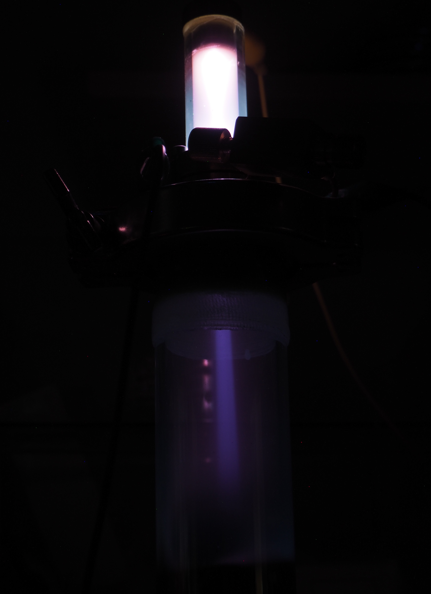

## Iongun

As a long term-goal for the diffusion pump would be nuclear fusion, and therefore an ion gun is one important step for this.
The principle is simple, a glass tube is mounted on a KF flange, with a small hole for the ions to pass through.
In the glass tube itself is a slightly higher pressure, that allows for a gas discharge and therefore to build up free ions.
An external electrical field will be applied to accelerate the ions towards the hole, where some will pass through into the high vacuum chamber.
I needed several attempts to make the assembly airtight.
First I tried to use vacuum grease but in the end, I noticed that the holes in the KF flange are slightly too big, so I ended up using epoxy.
The gas is fed through a copper capillary and a small hole on the side of the tube mount.
The pressure can be regulated with a needle valve, what usually is used for CO2 applications.

The first test was very promising, even though the vacuum wasn't ideal.
In fact, I wasn't able to open the valve even a bit as the pressure would increase too much.
The main problem was most likely, that the vacuum fittings were slightly dirty or had minor scratches, what could be fixed using vacuum grease.
Event though anode rays are clearly visible.

