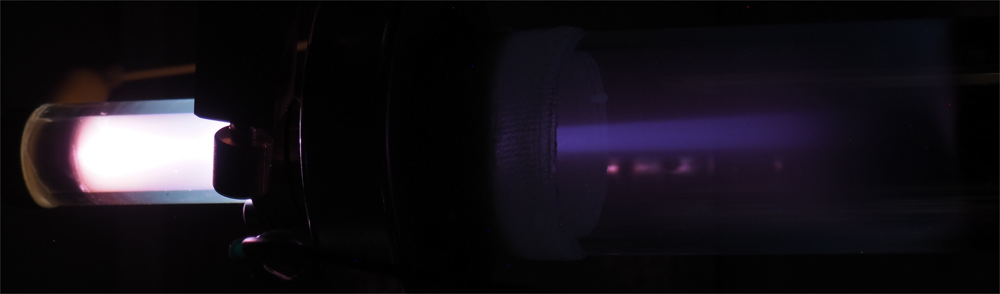
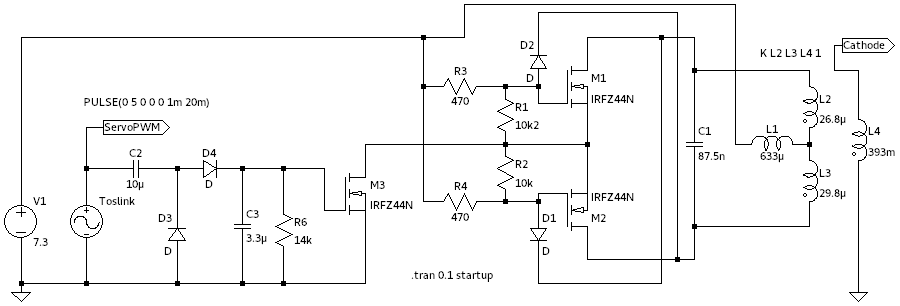

## Iongun

As a long term-goal for the diffusion pump would be nuclear fusion, and therefore an ion gun is one important step for this.
The principle is simple, a glass tube is mounted on a KF flange, with a small hole for the ions to pass through.
In the glass tube itself is a slightly higher pressure, that allows for a gas discharge and therefore to build up free ions.
An external electrical field will be applied to accelerate the ions towards the hole, where some will pass through into the high vacuum chamber.
I needed several attempts to make the assembly airtight.
First I tried to use vacuum grease but in the end, I noticed that the holes in the KF flange are slightly too big, so I ended up using epoxy.
The gas is fed through a copper capillary and a small hole on the side of the tube mount.
The pressure can be regulated with a needle valve, what usually is used for CO2 applications.

The first test was very promising, even though the vacuum wasn't ideal.
In fact, I wasn't able to open the valve even a bit as the pressure would increase too much.

## Update Oct 2018

To use the ion gun, a <a class="imgTooltip" href="images/driver.jpg">driver</a> providing a couple of kV has to build.
There are some tricky requirements to be achieved: 

1. High Voltage for Gas Discharge
2. Remote valve control via. servo
3. Galvanically isolated
4. Should be powered by a battery

The high voltage can be generated, as usual using a ZVS based circuit.
In this case, the transformer was homemade.
To increase the insulation of the secondary, each layer of the coil was separated by a layer of newspaper dipped in epoxy.

The PWM signal for the servo is generated by an Arduino, working as a remote control.
A Toslink cable provides galvanic insulation, so the setup can be controlled from a safe distance.
The same signal is used to switch the ZVS: if no signal is present, the should be no high voltage.
This was achieved by using a charge pump with a bleeding resistor to switch an additional FET.

## Fixed Leaks

After lots of debugging, we came to the conclusion, that the sealing of the glass tube using an O-Ring was problematic.
In the end, we fixed the problem using lots of epoxy.
As we now also have an additional power supply, we used the following setup to test the ion gun.
With an aperture of 4mm, a beam current of approx 30$$\mu$$A was measured.

Now with correct valve adjustment, a strong ion beam can be generated even though it is not that stable.
The discharge near the HV feedthrough indicates too much gas flow into the chamber.
A smaller aperture might help to fix this problem.

<iframe src="https://www.youtube.com/embed/5JS6N3vGuAY" width="560" height="315" frameborder="0"></iframe>
