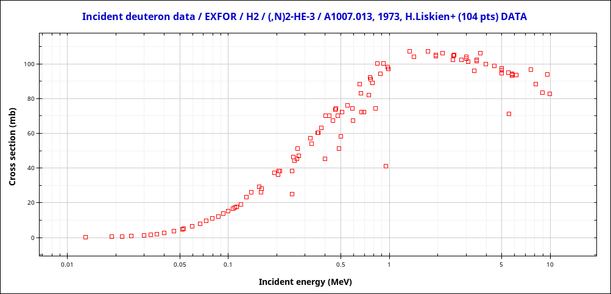
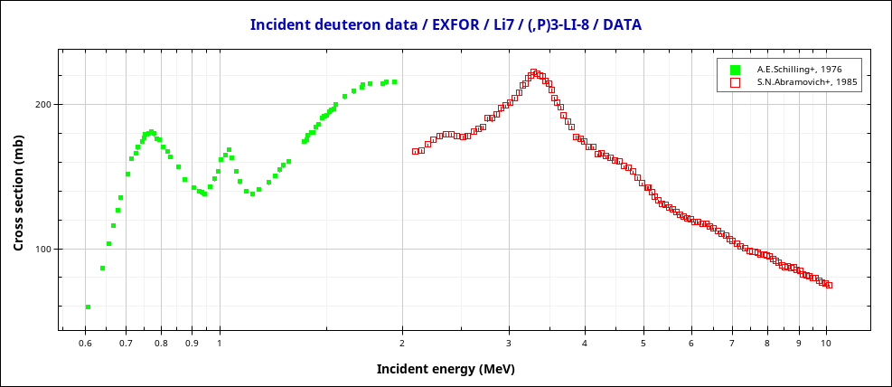
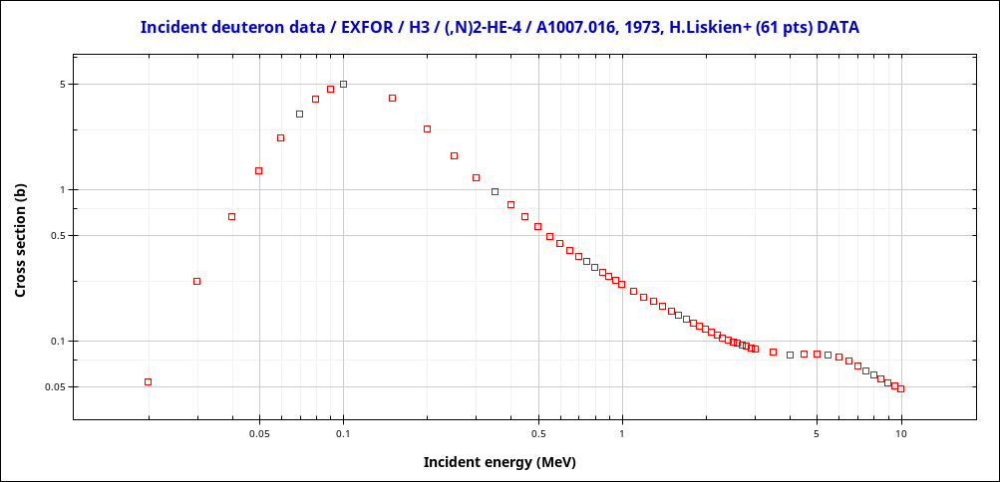
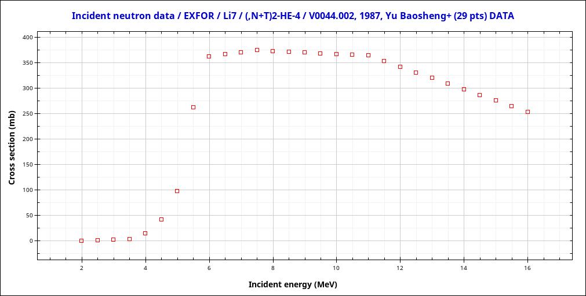
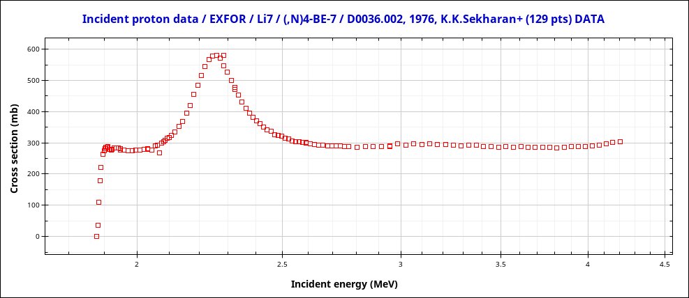
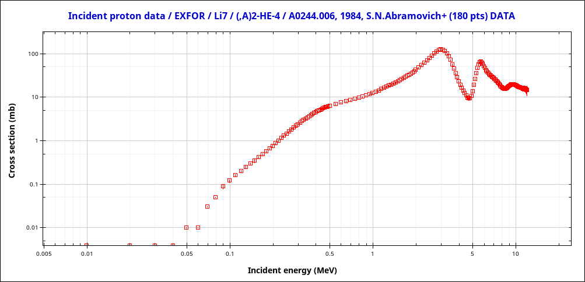
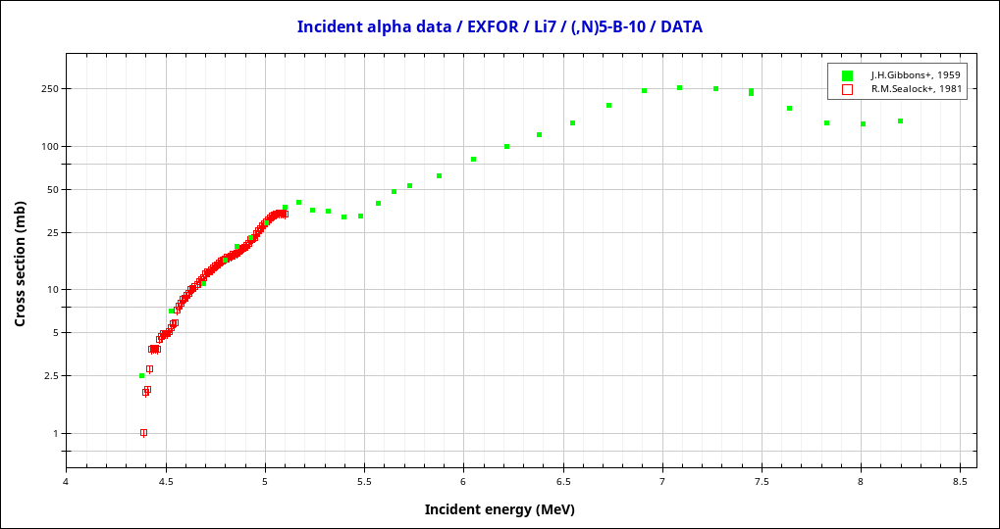
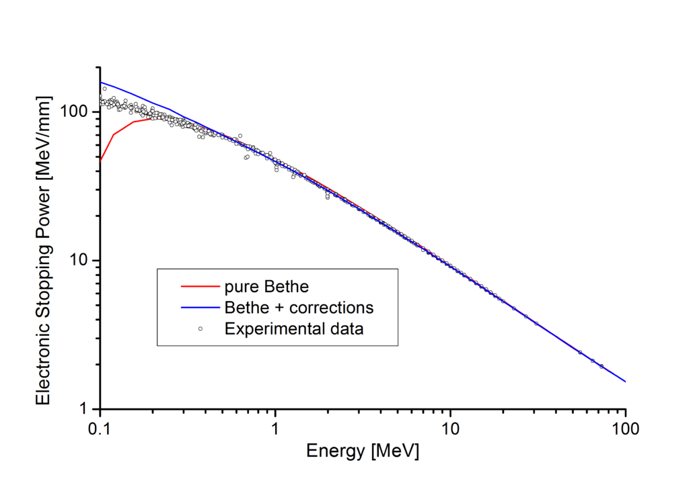

# Why Fusion must be Hot

In fusion bombs, a mixture of Lithium and Deuterium, e.g. Lithium deuteride $LiD$, was used to perform nuclear fusion with an (obviously) positive power factor.
Lithium deuteride is a stable salt, so why can't we use it in a molten salt reactor to gain energy?

The most common fusion reactions involve Deuterium and Tritium.
Tritium is a highly radioactive isotope, that does not occurs naturally.
But it is also possible to perform a fusion reaction using Deuterium, an element that occurs naturally in large quantities.
So let's take a bunch of $LiD$ and hit it with Deuterium at a couple of $keV$ and see what happens.
The first obvious reaction would be:

<table><tr><td>
    $$ D + D \rightarrow T (1.01 MeV ) + p (3.02 MeV)  $$
    $$ D + D \rightarrow He^3 (0.82 MeV ) + n (2.45 MeV)  $$
</td><td width="30%">
    
</td></tr></table>

In theory, the Deuterium could undergo an endothermic reaction with Lithium, but as the required energies of $~600keV$ are too high, this reaction can be ignored at the moment.
<table><tr><td>
    $$ Li^7 + D \rightarrow Li^8 + p - 0.19 MeV $$
</td><td width="30%">
    
</td></tr></table>
[//]: # Energy gain
[//]: # $$ 7.0160034366 + 2.01410175 - 8.022486246 - 1.00782503214 = -0.0002060915399995089 = -0.19197305262143546 MeV $$

# Second Stage

The generated particles from the $D+D$ reaction have a quite high energy, so they could induce further reactions.
E.g. the generated Tritium can undergo a fusion reaction, that gains even more energy than the $D+D$ reaction.
This reaction even has a 10 times higher cross section than the $D+D$ reaction.

<table><tr><td>
    $$ T + D \rightarrow He^4 (3.5 MeV) + n (14.1 MeV) $$
</td><td width="30%">
    
</td></tr></table>

Both, the $D+D$ and the $D+T$ reactions generate fast neutrons.
These neutrons can be used to breed more Tritium using Lithium.
Even though this reaction is endothermic, the neutrons are fast enough to trigger this reaction.
Also, a new neutron is generated so one $14MeV$ neutron could generate a couple of Tritium atoms.
These particles have a lower energy but certainly more than $100 keV$, the maximum cross section for the $D+T$ reaction.

<table><tr><td>
    $$ Li^7 + n \rightarrow He^4 + T + n - 2.74 MeV $$
</td><td width="30%">
    
</td></tr></table>

At this point, $LiD$ could reach criticality.
In theory, there can be a self-replicating chain reaction.

# Further Reactions

In addition, there are a couple of possible side reactions.
The protons can also react with the Lithium and generate even more neutrons.
Even though, they will be most likely too slow to breed new tritium as both reactions would require $4.38 MeV$.
<table><tr><td>
    $$ Li^7 + p \rightarrow Be^7 + n - 1.64 MeV $$
</td><td width="30%">
    
</td></tr></table>
[//]: # Energy gain
[//]: # $$ 7.0160034366 + 1.00782503214 - 7.016928717 - 1.00866491588 = -0.0017651641400002749 = -1.644239973822075 MeV $$

Even though with a slightly lower probability, we could end up with two alpha particles.
As those are quite stable, this reaction releases a huge amount of energy.

<table><tr><td>
    $$ Li^7 + p \rightarrow 2 He^4 + 17.34 MeV $$
</td><td width="30%">
    
</td></tr></table>

[//]: # Energy gain
[//]: # $$ 7.0160034366 + 1.00782503214 - 4.00260325413 - 4.00260325413 = 0.01862196047999909 = 17.3462462318913 MeV $$

Each alpha particle has a estimated energy of $8.67 MeV$ each, so they could undergo another endothermic reaction that produces neutrons.
The generated neutrons could in theory breed new Tritium, what would require only $5.53 MeV$.

<table><tr><td>
    $$ Li^7 + He^4 \rightarrow B^{10} + n - 2.79 MeV$$
</td><td width="30%">
    
</td></tr></table>
[//]: # Energy gain
[//]: # $$ 7.0160034366 + 4.00260325413 - 10.01293695 - 1.00866491588 = -0.002995175150000806 = -2.7899879669145604 MeV $$

# The Problem

Even though the reactions above are overall exothermic and could reach criticality, there is one big problem: Electrons.
As the charged particles pass an atom, they pull electrons out of the shells, what requires energy.
This process is called inelastic scattering and the energy loss can be approximated using the Bethe formula.
This chart shows the energy loss for a proton hitting an aluminum target.
The actual value is dependent on the target material and the incident particle but it gives an overview of the order of magnitude.

[Source](https://de.wikipedia.org/wiki/Bethe-Formel)

Let's have a close look at the Tritium generated by the $D+D$ reaction.
It has an energy of approx $1MeV$ and according to the chart we can estimate an energy loss of $80MeV/mm$
So the particle would be stopped after $1/80 mm = 12.5 \mu m$

How likely is a reaction of this particle?
The cross-sections are given in barn what is actually an area of $1barn = 10^{-24}cm^2$.
The underlying model is quite simple: Each particle gets a target according to the cross-section and if it is hit by the particle, the reaction is triggered, otherwise not.
The reaction probability for a short distance $z$ can be estimated as:

$$ P(z) = z \cdot \sigma \cdot density $$

Lithium deuteride is comparable to Lithium hydride and has a molar density of $ 0.78 g \cdot cm^{-3} / 7.95 g \cdot mol^{-1} = 0.098 mol \cdot cm^{-3}$
Lets assume the maximal cross section for the $D+T$ reaction of $5 barn$
We would expect a reaction probability of:

[//]: # 100keV particle
[//]: # and is approximately $100MeV/mm$ so an incomming $100keV$ particle would be stopped after approx. $1\mu m$.
[//]: # $$ P(1\mu m) = 0.0001 cm \cdot 0.3 \cdot 10^{-24} \cdot 6.02 \cdot 10^{23} * 0.098 \frac{1}{cm^3} = 1.764 \cdot 10^{-6}$$

$$ P(12.5\mu m) = 0.00125 cm \cdot 5 \cdot 10^{-24} cm^2 \cdot 6.02 \cdot 10^{23} * 0.098 \frac{1}{cm^3} = 0.000368725$$

At his point the whole thing becomes a joke... Even with the utopic cross-section estimation, only 0.03% of the generated tritium atoms would undergo a fusion reaction.
This problem could be overvome by stripping all electrons beforehand, namely converting some reactants to plasma.
So the particles have to have more energy than the bounding energy of the electrons.
This energy is in the order of $54eV$ for the innermost $K$ shell of Lithium.
That seems negligible in comparison to the $MeV$ of the other particles but equals a temperature of roughly 594,000 Kelvin.
Thati's the reason fusion must be hot.

[//]: # [ASTAR](https://physics.nist.gov/PhysRefData/Star/Text/ASTAR.html) to compute the stopping force.

[//]: # Stuff used to compute the energy gain
[//]: # Constant | Value
[//]: # | --- | --- |
[//]: # $$ 1u $$ | $$ 931.4940954 MeV $$
[//]: # $$ 1e $$ | $$ 1.6021766208e-19 C $$
[//]: # $$ 1mol $$ | $$ 6.022e23 $$
[//]: # 
[//]: # Isotop | Mass
[//]: # | --- | --- |
[//]: # $n$ | $$ 1.00866491588 u $$
[//]: # $$ H^1 $$ | $$ 1.00782503214 u $$
[//]: # $$ D $$ | $$ 2.01410175 u $$
[//]: # $$ T $$ | $$ 3.0160495 u $$
[//]: # $$ He^3 $$ | $$ 3.0160293201 $$
[//]: # $$ He^4 $$ | $$ 4.00260325413 u $$
[//]: # $$Li^6$$ | $$ 6.0151228874 u $$
[//]: # $$Li^7$$ | $$ 7.0160034366 u $$
[//]: # $$Li^8$$ | $$ 8.022486246 u $$
[//]: # $$Be^7$$ | $$ 7.016928717 u $$
[//]: # $$B^{10}$$ | $$ 10.01293695 u $$

[//]: # # Rapp Comparison
[//]: # 
[//]: # | What | Amount |
[//]: # | :---: | :---: |
[//]: # | Fusion Rate | $$ 1e5 $$ n/s |
[//]: # | Ion current | $$ 30 \mu A $$ |
[//]: # | Particle Counts | $$ 1.87e14 $$
[//]: # | Mol / s | 3.1e-10 |
[//]: # 
[//]: # Particles per Second
[//]: # 
[//]: # $$ 30 \mu A / 1.6021766208e-19 C = 1.8724527377649771e14 $$
[//]: # 
[//]: # Mol per Second
[//]: # 
[//]: # $$ 1.8724527377649771e14 / 6.022e23 = 3.1093535997425723e-10 $$
