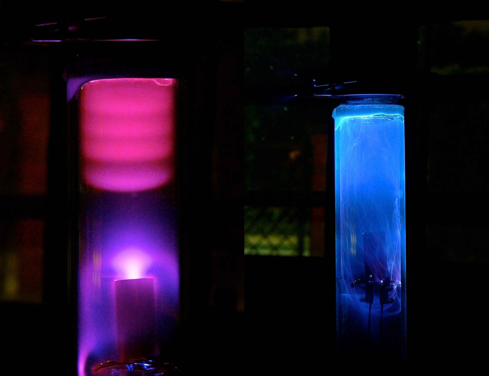

# Diffusion Pump

A few years ago, i was able to buy a refurbished diffusion pump on ebay for only 120€.
These pumps can generate a very high vacuum

To test the Pump for the first time, some additional parts are required, such as a rotary vacuum pump and some Vacuum fittings.
Using a filament of a halogen lamp and a high voltage power supply, a simple diode can be build, generating a massive amount of xrays.
The foto was made using a delayed shutter and the high voltage supply was enabled using a safe distance of a couple of meters behind a wall to avoid unnecesarry irradiation.
The geiger counter shows a dose rate of 1 mSv a couple of centimeters away.

The difference between a low preassure and a high vacuum discharge are shown in the following picture.
These Pictures were made using a 4cm glass tube that can be evacuated with the vacuum pump.
A high positive voltage is applied on the top, wheras the bottom copper tube is grounded.
Even with the pre vacuum pump, cathod rays are visible.
With the diffusion pump enabled, there not enough gas molecules that allow a discharge.
Instead arcing takes place on the inside of the glas tube, due to some impurities.

