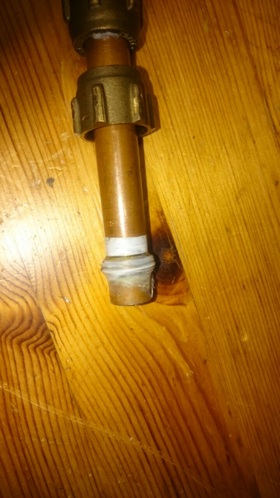
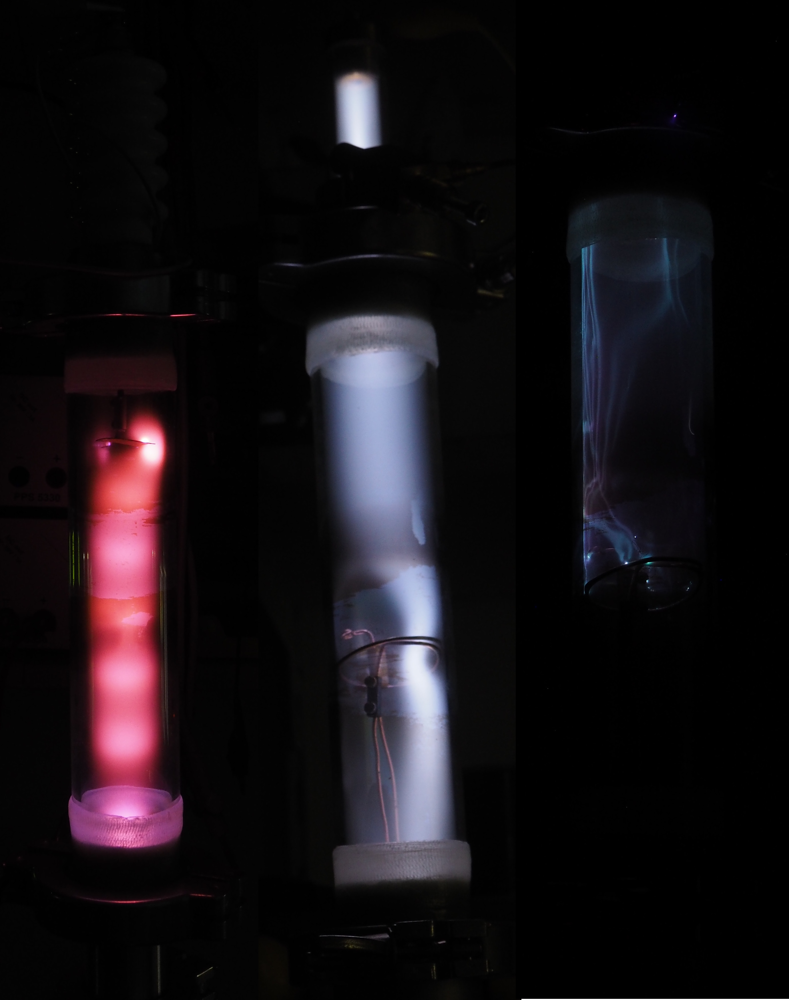

# Diffusion Pump

A few years ago, I was able to get a cheap refurbished diffusion pump on eBay, which can generate a very high vacuum.
To test the Pump for the first time, some additional parts are required, such as a rotary vacuum pump and some vacuum fittings.
As the pump needs water cooling, a small aquarium pump and a large cup of water were used.
Using a filament from a halogen lamp and a high voltage power supply, a simple diode can be build generating a massive amount of X-rays.
Electrons are emitted from the glowing tungsten wire and are accelerated to the positive plate.
If the vacuum is good enough that the electrons are not slowed down by remaining gas, the assembly should be able to generate some X-rays.
The following foto was taken using a delayed shutter and the high voltage supply was switched on from a safe distance of a couple of meters behind a concrete wall to avoid unnecessary irradiation.
The Geiger counter shows a dose rate of 1.5 mSv/h a couple of centimeters away.

The difference between a low pressure and a high vacuum discharge is shown in the following.
These Pictures were made using a glass tube with a 4cm diameter, that can be evacuated.
A high positive voltage was applied on the top using the 40kV cascade, whereas the bottom copper tube is grounded.
On the left-hand side, the diffusion pump is switched off, and the typical cathode rays and positive column are clearly visible.
With the diffusion (right), there are not enough gas molecules left for a gas discharge.
Instead, arcing takes place on the inside of the glass tube, due to impurities on the surface.
In addition, some X-rays are generated.

As the pump was not in used for several years, the first startup was a little bit problematic.
No matter what we tried, the diffusion pump did not create a high vacuum and we still had a gas discharge.
We noticed that by just using the backing pump we only achieved a couple of hundreds volt for a gas discharge.
By using [Paschen's law](https://en.wikipedia.org/wiki/Paschen%27s_law#/media/File:Paschen_curves.svg), we eyeballed a pressure of ca. 1mBar, but the diffusion pump requires a pressure of at least 0.4mBar.
The copper pipe seals seem not to be ideal for vacuum use, as they tend to turn a little bit if some force is applied and they become leaky after some time.
This problem could be solved by simplifying the hub and remove all of those flanges.

---
# Fixing Bugs

In the end, we noticed, that the problem could be identified earlier by just comparing the color of the gas discharges.
For a leaky pump, a lot of air is present in the chamber and therefore a slightly orange/blue discharge can be observed.
After fixing the issue the gas discharge turned to white.
From left to right:
* Leaky backing pump
* Fixed backing pump (comparable to leaky pump + diffusion pump)
* Fixed backing pump + diffusion pump

