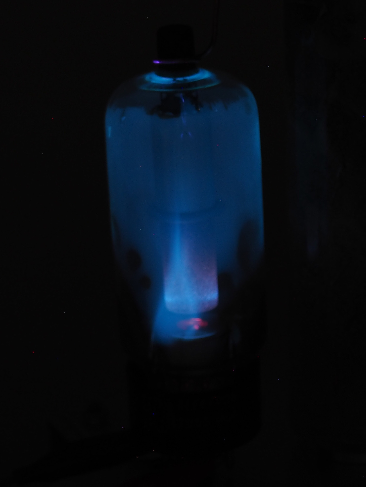

## Rectifier Tube

Instead of building a X-Ray tube using a high vacuum pump, we can also use high voltage rectifier tubes as they were used in very old televisions.
The top terminal is insulated enough, to apply voltage much higher than the recommended 20kV.
Even though if the filament is provided with full power, the current through the tube is too high so the applied voltage will drop so that no X-Rays are generated.
Using a lab power supply to adjust the filament voltage was not to be a good idea, as the tube current is not constant the electronics goes crazy if it's hit by high voltage spikes.
This results in random action by the power supply which can easily damage the tube.
Instead a small transformer and a couple of resistors were used.
If everything is setup correctly, the glass will fluorescent as it is hit by X-Rays.
As it's not a good idea to stand next to the tube, while it is running, a camera was set up with an exposure time of 60sec and the high voltage was switched on from behind a concrete wall.
Even though I measured a dose rates of 3-5 uSv/h what is roughly 30 time background and comparable to what you will get in a plane.

