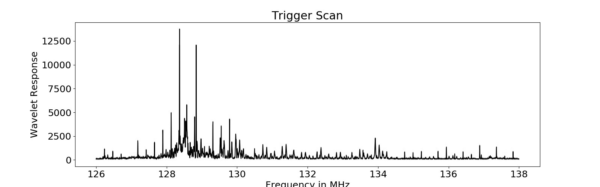
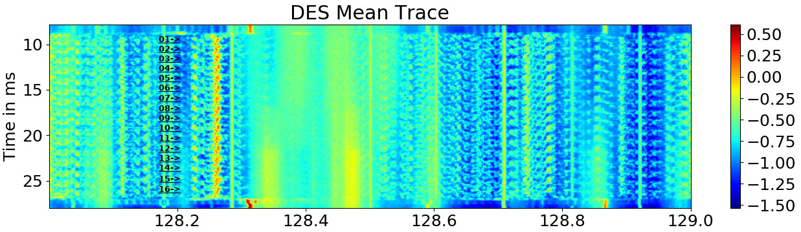

## Leakage

By using the method for finfing trigger frequencies, we can scan the spectrum to search for sidechannel leakage for a new device.
Most of the leakage is located between 3MHz - 4MHz.
I'm currently not shure if this is a characteristic of the Arduino or just the resonance frequency of the Antenna.

## DES

A DES is implemented on the Arduino to search for sidechannel effects.
By averaging the spectrogram over multiple traces, the following spectrogram can be obtained.
A repeating pattern occures that is caused by the individual rounds of the DES.

