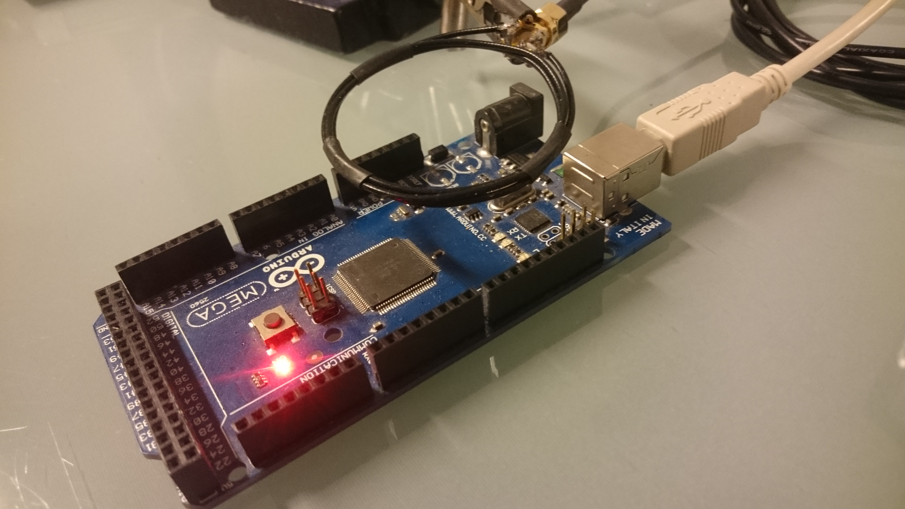

## Leakage
Also embedded devices are vulnerable to EM attacks.
A small loop antenna can be used to pick up such signals.

A DES is implemented on the Arduino to search for side-channel effects.
By averaging the spectrogram over multiple traces, the following spectrogram can be obtained (captured at ~3.5MHz).
A repeating pattern occures that is caused by the individual rounds of the DES.

Even though it was not possible to find any correlation between the spectrogram and key bits.
Most likely, the time resolution of the spectrogram is too low, to get a good correlation.
The next attempt was done by using a demodulated time series signal.
A new static alignment was implemented, that works on time series signal was implemented.

I've selected a carrier close to the clock frequency at 16.253MHz, applied a low pass filter with 233kHz bandwidth and amplitude demodulated the signal.
The resulting signal has a lot of high frequency components and thus it looks a bit noisy.
Even though after 6022 traces the noise still remains, so it is actually caused by the CPU and could contain sidechannel information.

## Breaking DES
A good method for breaking DES with a power analysis is the so called Correlation Power Analysis.
It uses the fact that a XOR operation with 1 (aka bit flip) uses more power than xor with 0.
The important part of the DES is the application of the sbox in the first round.

$$ l = l \oplus sbox_i[r \oplus k_i] $$

$l$ and $r$ are parts of the plaintext and can be controlled by the attacker, $k_i$ is a 6 bit subkey and the sbox is a nonlinear lookup table.
The number of bit flips depends on a part of the plaintext and a part of the key.
The attack now correlates the hamming weight of the output of the sbox with the actually measured power consumption.

$$ corr(s_t, ham(sbox_i[r \oplus k_i])) $$

This pearson correlation is computed for all 64 subkeys and every timestep of the power trace.
For the right subkey, we expect a high correlation with the actual measured sample $s_t$ exactly at the point, where the addition happens.
The following image shows the correlation for the correct subkey of the first sbox (black) and the mean trace (gray) after 6022 traces.
The spikes in the beginning of the DES routine is caused by the xor operation with the sbox output.

By comparing the maximum correlation over time for all possible subkeys, the correct subkey had the highest correlation after 1500 traces.

