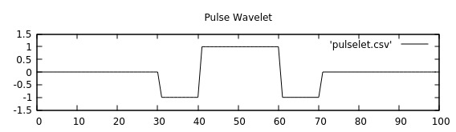

## Abstract

A SDR samples a part of the RF spectrum as a stream of complex samples.
To perform Sidechannel analysis on these signals, the samples corresponding to the execution of the test program has to extracted from the raw stream.

## Extraction
By executing a test program on a DUT, changes in the spectrogram can be observed.
On many devices, some carrieres correlate with the execution of the test program.
The following image shows a example spectrogram, wheras the individual executions are marked with small arrows.

In this example, as the program is executed, some carrier frequencies are interrupted.
One of this carriers can be filtered and amplitude demodulated to obtain a trigger signal, that can be used for alignment.
The following image shows such a trigger signal, wheras the individual trigger frequencies are clearly distinguishable.

The start and end of the execution could simply be determined by using a static threshold, even though this method is not very robust and requires manual calibration.
A more robust method would be to use a Haar-Wavelet (slope), that will be shifted over the signal.
The following image shows the response for such a Wavelet.
The individual traces can now be extracted by searching for maxima in this transformed signal.

## Finding trigger frequency
To avoid manual search for the trigger frequency, an automatic aproach is used to find frequencies, that provide a strong trigger signal.
To find such frequencies, first 10 executions of the test program are performed at a fixed delay.
A pulsar wavelet as shown below is used to detect interruptions or amplifications of freqeuencies in the spectrogram.

The pulse length can be estimated by the time between the challenge and response and the wavelet is repeated for each exectuion.
This 'multi pulse wavelet' is then shifted over the spectrogram.
The result of such a wavelet transform of the spectrogram is shown below.

Some frequencies show high response, if the offset of the wavelet matches the offset in the captured signal.
These also match the carrier frequencies in the spectrogram above.
By searching for the maximum ins this transformed signal, the best trigger signal can be determined.

## Static alignment

## Dynamic alignment
