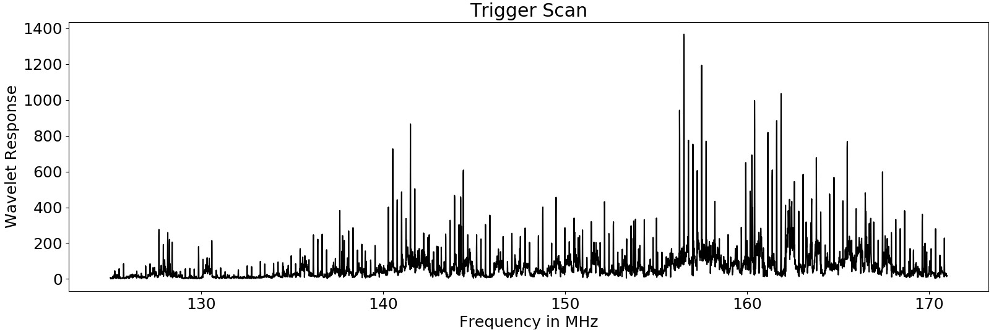
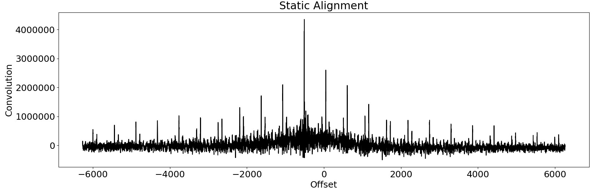

## Abstract

An SDR digitizes a small part of the RF spectrum and sends the data as a stream of complex samples to the computer.
To perform side-channel analysis using these signals, the samples corresponding to the execution of the test program has to be extracted from the raw stream.
So an algorithm is needed to detect the execution of a test program.
For simplicity, it is assumed, that there are no other programs with a noticeable CPU load running.

## Extraction
By executing a test program on a DUT, changes in the spectrogram can be observed.
On many devices, some carriers get stronger or weaker as the CPU starts to consume more power as shown in the introduction.
The following image shows an example spectrogram.
Multiple executions of a test program are triggered (marked with arrows) with a constant delay.
The executions are clearly distinguishable from the idle CPU state.

In this example, as the program is executed, some carrier frequencies are interrupted.
To detect a particular execution, one of this carriers can be filtered and amplitude demodulated to obtain a trigger signal.
The following image shows such a trigger signal, whereas the individual executions are visible as dips in the signal.

In this case, the start and end of the execution could simply be determined by using a static threshold, even though this method is not very robust as other programs or interference can cause small spikes in the signal.
A more robust method would be to use a Haar-Wavelet (slope), that will be multiplied by the trigger signal on different positions.
The wavelet response is the total integral of the obtained signal.
This wavelet is convoluted with the signal, wheras the convolution is defined as follows, wheras k is the offset:

$$ conv_{ab}[k] = \sum_i a[i+k]b[i] $$

As the wavelet has a total integral of zero, it generates a high absolute response if the position of the wavelet matches a slope in the signal.

The Haar-Wavelet has a rectangular shape, so it can be computed very efficiently.
First, the trigger signal is integrated once.
The wavelet response can be computed by adding and subtracting the corresponding samples.
The width of the slope is chosen in a way, that it matches the estimated width of the execution.
The following image shows the resulting response (absolute value) for the wavelet response for the trigger signal.

To extract the n executions, a search for 2n maxima is performed on that response.
For every occurrence, the surrounding samples are set to zero to find individual spikes.
This gives us the start and end for every execution, that can be mapped to the raw signal.

## Finding trigger frequency
To avoid the manual search for the trigger frequency, an automatic search is used.
At first 10 executions of the test program are performed with a fixed delay.
This time a pulsar wavelet as shown below is used to detect executions.
As we do not need high resolution in time, the search is performed on the spectrogram.

The pulse length can be estimated by the time between the challenge and response.
The wavelet is repeated for each execution matching the known delay between the executions.
This 'multi-pulse wavelet' is then shifted over the spectrogram.
The result of such a wavelet transform of the spectrogram is shown below.

Some frequencies show a high response if the offset of the wavelet matches the offset in the captured signal.
These frequencies with a high response can be used as a trigger signal.
By searching for the maximum ins this transformed signal, the best trigger frequency can be determined.

This method can also be used to scan the spectrum to find side-channel leakage for a new device.
The image shows the wavelet response for an Arduino Mega2560 (16MHz processor) from 0MHz - 45MHz.
As an upconverter was used, the frequency values have a constant offset of 125MHz.
Interestingly there are also lots of side channel effects in the 30MHz-40MHz, twice as high as the CPU clock.
The actual response also depends on the resonance frequency of the antenna.

## Static Alignment
Even though the trigger algorithm extracts traces reliable, there is still some misalignment.
One reason for this is that the trigger signal has a lower sampling rate than the demodulated signal, so a fine-grained alignment method is required.
The first trace is used as a reference and further traces are aligned using convolution with this trace.
It is important, that both traces are zero mean, otherwise, the result is influenced too much by the number of samples.
With low bandwidth time series traces, this method works well without too much overhead.

This image shows the convolution of two misaligned traces.
The offset is clearly visible as the maximum response.
