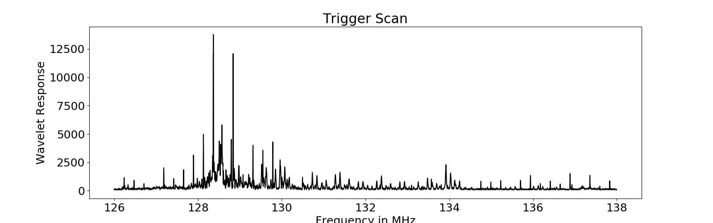

## Abstract

A SDR digitizes a small part of the RF spectrum and sends the data as a stream of complex samples to the computer.
To perform side-channel analysis using these signals, the samples (time span) corresponding to the execution of the test program has to extracted from the raw stream.
So an algorithm is needed to detect the execution of a test program.
For simplicity it is assumed, that there are no other programs with a noticable CPU load running.

## Extraction
By executing a test program on a DUT, changes in the spectrogram can be observed.
On many devices, some carrieres get stronger or weaker as the CPU starts to consume more power as shown in th e introduction.
The following image shows a example spectrogram.
Multiple executions of a test program are triggered (marked with arrows) with a constant delay.
The executios are clearly distinguishable from the idle CPU state.

In this example, as the program is executed, some carrier frequencies are interrupted.
To detect a particular execution, one of this carriers can be filtered and amplitude demodulated to obtain a trigger signal.
The following image shows such a trigger signal, wheras the individual executions are visible as dips in the signal.

In this case, the start and end of the execution could simply be determined by using a static threshold, even though this method is not very robust as oher programs can cause small spikes in the signal,
A more robust method would be to use a Haar-Wavelet (slope), that will be multiplied with the trigger signal on different positions.
The wavlelet response is the total integral of the obtained signal.
As the wavelet has a total integral of zero, it generates a high absolute response if te position of the wavelet matches a slope in the signal.

As the Haar-Wavelet has a rectangular shape, it can be cumputed very efficiently.
First the trigger signal is integrated once.
The wavelet response can be computed by adding and substracting the corresponding samples to compute the wavelet response.
The width of the solpe is chosen in a way, that it matches the estimated width of the execution.
The following image shows the resulting response (absolute value) for the wavelet response for the trigger signal.

To extract the n executions, a search for 2n maxima is performed on that response.
For every occurence, the sourounding samples are set to zero to find individual spikes.
This gives us the start and end for every execution, that can be mapped to the raw signal.

## Finding trigger frequency
To avoid manual search for the trigger frequency, an automatic search is used.
At first 10 executions of the test program are performed with a fixed delay.
This time a pulsar wavelet as shown below is used to detect executions.
As we do not need high resolution in time, the search is performed on the spectrogram.

The pulse length can be estimated by the time between the challenge and response.
The weavelet is repeated for each exectuion matching the known delay between the executions.
This 'multi pulse wavelet' is then shifted over the spectrogram.
The result of such a wavelet transform of the spectrogram is shown below.

Some frequencies show high response, if the offset of the wavelet matches the offset in the captured signal.
These frequencies with a high response can be used as a trigger signal.
By searching for the maximum ins this transformed signal, the best trigger frequency can be determined.

This method can also be used to scan the complete spectrum to find side-channel leakage for a new device.
The image shows the wavelet response for an Arduino Mega2560 from 1MHz - 13MHz.
As an upconverter was used, the frequency values have a constant offset of 125MHz.
The spike at 3.5MHz might be caused either by resonance of the used antenna or by the device itself.
Even though this would be a great starting point for further analysis.

