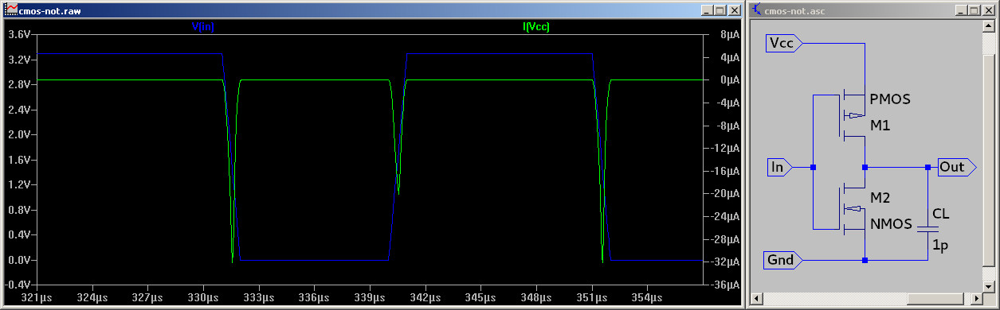
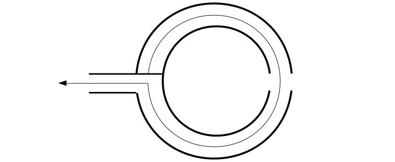

## Electrical Emmanation Attacks

All electronic devices create some sort of electrical emmanations, that are caused by voltage and current fluctuations.
These can be measured either using a digital storage oscilloscope and a suitable antenna or like in this case with an SDR receiver.
A SDR has the advantage of built in analog preamplification and filtering (frequency selection), which can be configured by software.
In addition many DSP frameworks are available, that already support SDRs, such as GNURadio allow realtime analysis of those signals, so there is no limitation by a sample buffer.
As a downside much lower sample rates are achieved e.g. 2Mhz-56MHz istead of several GHz.

## Origin of Side-Channel Effects

Most digital circuits are realized as CMOS gates with an positive and negative transistor group.
For each gate output, either the PMOS or NMOS group of transistors is connecting the output of the gate to VCC or ground.
A simulation of NOT gate is shown in the following picture.



With a static view of such a gate, there should be no current flowing through the gate as either the CMOS or PMOS transistor is not conducting.
Even though if a gate output changes its value and thereby its voltage, there are two effects, that causes a short current flow:

1. For a short period, both transistors are partially conductive
2. The tiny capacitance between surrounding wires has to be charged or discharge

This leads to the Hamming-Distance model of Power consumption, that the powerconsumption of CMOS gate is proportional to the number of flipping bits.

## [Arduino](arduino.md)

The most common case for side channel attacks are embedded devices, such as smart cards.
In this case an arduino will be used as a target, as they are easy reprogrammable.
The CPU runs at a frequency of 16MHz.
A small Loop antenna is used to pick up electrical emmanations caused by the device, that gets analyzed by an SDR.


## [Pickups]
The most experiments are done with loop antennas or 'magnetic field probes'.
Instead of buying professional ones, I build them my self using of the shelf coax cable.
The construction is fairly simple: a small section of the shielding is removed at the middle of the cable and on one side the core is connected with the shielding.



Depending on the number of turns and diameter of the antenna, the resonance frequency will change.
A 3 turn antenna mostly works for frequencies lower than 10MHz, wheras a one turn loop antenna still works at 40MHz.
The strongest side channel effects might not even be visible, if the wrong antenna is used.

## [Desktop PC](sca/openssl.md)

Even desktop PCs and Laptops can emmit exploitable side-channel effects, as Genkin et.al. showed.
These are mostly caused by the CPU voltage regulation, that stabilizes the high frequency fluctuations of the CPU power consumption using inductiors and capacitors.
Low frequency signals are emmited that are changing with the powerconsumption of the CPU and thus different operations.
The following image shows an example setup for side-channel analysis of a desktop PC:


The desktop PC on the left is the Device Under Test (DUT) with a loop antenna on top, that gets 'attacked' by the laptop on the right
In the middle a SDR receiver and an upconverter is located.
Latter is required as this SDR can only receive signals down to 50MHz so the signal has to be shifted in frequency domain to be processed by the SDR.

The following programm can be used to test for basic side-channel effects.
The task would to distinguish between an idle and busy CPU.

```python
import time
while 1:
    for i in xrange(40000000): pass
    time.sleep(1)
```
The program 'uhd_fft' or 'osmocom_fft' from the GNURadio toolchain can be used to visualize the RF spectrum.
As we can see, there are obvious differences in the spectrogram caused by the change of the CPU load.


Further analysis of this Dell Optiplex showed an interesting side-channel leakage.
The following spectrogram shows OpenSSL multiplications encapsulated by dummy operations (tight for loop)
It seems that the side-channel effects are frequency modulated on some carrieres.


