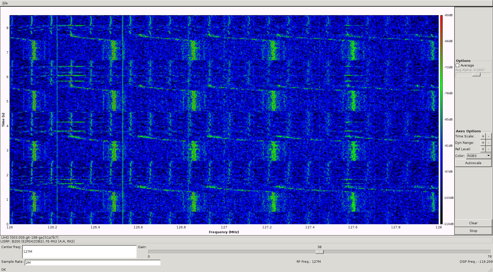
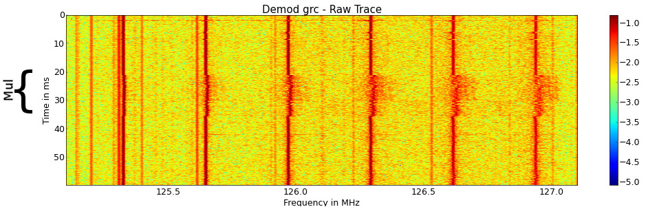

## Electrical Emmanation Attacks

All electronic devices create some sort of electrical emmanations, that are caused by voltage and current fluctuations.
These can be measured either using a digital storage oscilloscope and a suitable antenna or like in this case with an SDR receiver.
A SDR has the advantage of built in analog preamplification and filtering (frequency selection), which can be configured by software.
In addition many DSP frameworks are available, that already support SDRs, such as GNURadio allow realtime analysis of those signals, so there is no limitation by a sample buffer.
As a downside much lower sample rates are achieved e.g. 2Mhz-56MHz istead of several GHz.

## Origin of Sidechannel Effects

Most digital circuits are realized as CMOS gates with an positive and negative transistor group.
For each gate output, either the positive or negative group is connecting the output of the gate to VCC or ground.
With a static view of such a gate, there should be no current flowing through the gate as either the positive or negative group is open.
Even though if a gate output changes its value and thereby its voltage, the tiny capacitance between surrounding wires has to be charged or discharged resulting in a small current.
This leads to the Hamming-Distance model of Power consumption, that the powerconsumption of CMOS gate is proportional to the number of flipping bits.


## [Desktop PC](sca/openssl.md)

Even desktop PCs and Laptops emmits exploitable sidechannel effects, as Genkin et.al. showed.
These are mostly caused by the CPU voltage regulation, that stabilizes the high frequency fluctuations of the CPU power consumption using inductiors and capacitors.
Low frequency signals are emmited which are changing with different operations in the order of milliseconds.
The following image shows a example setup for sidechannel analysis of a desktop PC:


The desktop PC on the left is the Device Under Test (DUT) with a loop antenna on top, that gets 'attacked' by the laptop on the right
In the middle a SDR receiver and an upconverter.
Latter is required as this SDR can only receive signals down to 50MHz so the signal has to be shifted in frequency domain to be processed by the SDR.

The following programm can be used to test for basic sidechannel effects.
The task ist to distinguish between an idle and busy CPU.

```python
import time
while 1:
    for i in xrange(40000000): pass
    time.sleep(1)
```
The program 'uhd_fft' from the GNURadio toolchain can be used to visualize the RF spectrum.
There are obvious differences in the spectrogram caused by the change of the CPU load.



Further analysis of this Dell Optiplex showed an interesting side-channel leakage.
The following spectrogram shows OpenSSL multiplications encapsulated by dummy operations (tight for loop)
It seems that the sidechannel effects are frequency modulated on some carrieres.



## [Arduino](arduino.md)

Also embedded devices such as an Arduino show sidechannel effects.
Similar to the desktop PC setup, a small loop antenna was used to pick up such signals.


