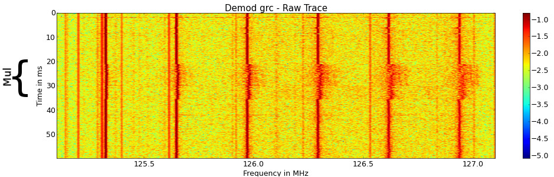
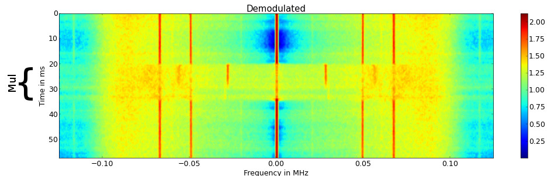
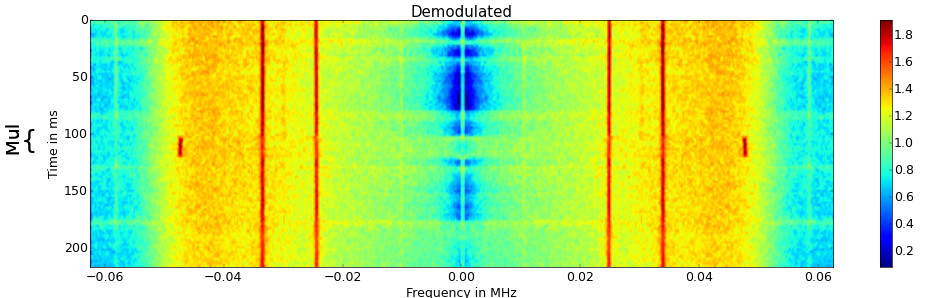
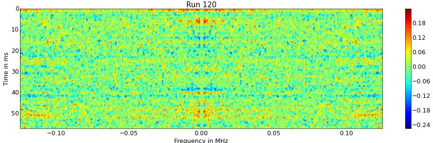
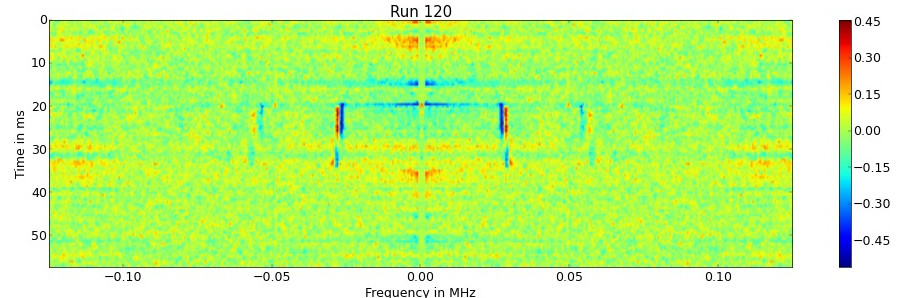

<script src="js/w3.js"></script>
<div w3-include-html="bar.html"></div>
<script>w3.includeHTML();</script>

## Abstract
OpenSSL implements arithmetic primitives such as multiplication and exponentiation in the 'Big Number Library'.
These primitives often shows side channel effects, that can be measured using a software defined radio.
The following experiments are done on a Dell Optiplex.


## Multiplications

To test for sidechannel effects of the multipication routine of OpenSSL the following code was used.
r is a random number and arg is user controlled input.

```C
for (i=0; i < 8000000; i++) i ^= 0;
for (i=0; i < 400; i++) BN_mod_mul(r,r,arg,N);
for (i=0; i < 8000000; i++) i ^= 0;
```

The Spectrogram shows the execution of the test program on a Dell Optiplex.
The multiplications are clearly distinguishable from the dummy operations, as the noise on the frequency axis increases.
This seems to be an example of frequency modulated sidechannel leakage.



By demoulating a single carrier the following signal was obtained.
Again the Multiplications are clearly visible as a new carrier is appearing in the demodulated signal.



This image again shows the deomulated signal of the multiplications but instead of 4096-bit, 2048-bit numbers were used.
It seems that the runtime of the multiplications correlate with the newly appearing carrier frequency.



One advantage to Differential Poweranalysis is, that it can be easily adopted to data with a higher dimension.
In this case Differential power analysis is directly performed on the spectrogram, that reveals the location of sidechannel leakage in time and frequency domain.

The following image shows a DPA on the spectrogram of multiplications, wheras arg are two different numbers lower than N.
No obvious differences can be observed.



If we choose one number greater and one smaller than N, strong differences can be observed in the spectrogram.
This means it is possible to compare one argument with N just by looking at the electrical emmanations of the device.


