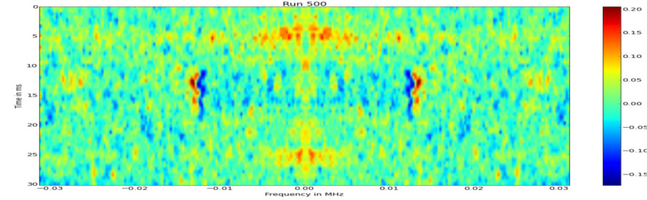
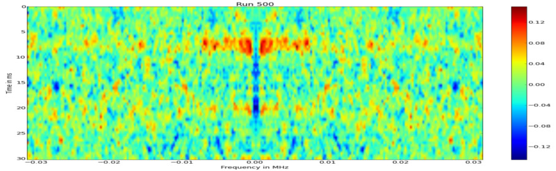

## Abstract
OpenSSL implements arithmetic primitives such as multiplication and exponentiation in the 'Big Number Library'.
These primitives often shows side channel effects, that can be measured using a software defined radio.
The current implementation uses base blinding, so the attack described here will not work on the full RSA implementation.
Even though, the attack is very interesting from a technical point of view.

A big (15cm diameter) 3 turn loop antenna was used to pick up the signal.
The case was opened to good signal strength but even with a closed case, some of the signals still leak through the case.


## Geting a Signal
First we have to check, if different operations are distinguishable from the signals.
As we deal with a highly complex architecture (in comparsion to a Smart Card) this is not trivial.
The CPU runs at a high clock rate so only slow operations such as RSA encryptions can be analyzed.
The following program was used to test fpr sidechannel effects, $r$ is a random number and $arg$ is user controlled input.

```C
for (i=0; i < 8000000; i++) i ^= 0;
for (i=0; i < 400; i++) BN_mod_mul(r,r,arg,N);
for (i=0; i < 8000000; i++) i ^= 0;
```

The Spectrogram shows the execution of the test program on a Dell Optiplex from 0-2MHz.
Mutiple harmonics of the same signal are visible, which should all contain the same information but with increasing bandwidth from left to right.
The multiplications are clearly distinguishable from the dummy operations, as the noise on the frequency axis increases for all carriers.
This seems to be an example of frequency modulated side-channel leakage.


One of the carrieres was filtered and frequency demodulated.
The result is a very clean spectrogram (averaged over several traces) that contains only three frequencies.
Note that the symmetry of the spectrogram is caused by the frequency demodulation what is a real signal.
Again the Multiplications are clearly visible as a new carrier is appearing in the demodulated signal.


The previous spectrogram was the result of multiplication with 4096 bit modul, the same experiment was repeated with 2048 bit one.
As the numbers are "shorter", the total runtime of the multiplications also decreases.
Interestingly, the carrier, that is caused by the multiplication routine has shift in frequency.
It could be, that this carrier is caused by the repetition frequency of the multiplications.


## DPA BN_mod_mul

Differential Power analysis is a simple method to detect differences in side-channel effects caused by different inputs.
The idea is to perform multiple measurements with different arguments and divide them into two different groups.
In this case we choose two numbers $A < N < B$.
The DPA then computed as the difference of the mean measurements.

$$ DPA(A,B) = E(A)-E(B) $$

This Differential Poweranalysis can also be adopted to data with a higher dimension such as time series or spectrograms.
By performing the analysis for the OpenSSL multiplications, obvious differences can be observed.
It seems, that the carrier that is caused by the multiplication has shifted in frequency.
As the multiplication routine has similar known timing side channel, this is also an indication, that the carrier is caused by the repetition of the multiplication routine.


To confirm, this is a actual sidechannel and not a measurement error, the same experiment is repeated with two numbers $ A , B < N $.
No more differences can be observed in the spectrogram.
By using this sidechannel, we can compare numbers with the modul.


## DPA BN_mod_exp

OpenSSL is using the fiexd window exponentiation, that is a extension of the Square and Multiply algorithm.
First a table $pow$ of precomputated small powers is created.
Then it is iterated over the bits of the exponent in $m$ bit blocks and the results of $pow$ array is used to compute the result.

```
function m_array_exp(c,d,N) // c^d mod N
    c = c mod N
    m = 5

    //pow[i] = c^i mod N
    pow[0] = 1
    for i = 1...m
        pow[i] = pow[i-1] * c mod N

    D = Fragmentation of d in m-Bit words
    k = length(D)

    r = D[k-1]
    for i = k-2...0
        res = r ^ (2^m) mod N // m times squaring
        if D[i] > 0
            r = r * pow[D[i]] mod N //i=1: Side-Channel

    return r
```

Not that if $D[i] = 1$ we have effectively a multiplication with a random number and $c ^ 1$, our attacker controlled input.
For a 2048 bit exponentiation, this means we have $2048/5 = 410$ iterations of the for loop and $410 / 2^{32} = 12$ multiplications with our attacker controlled input in average.
This is much fewer than the in the previous experiments, but with ca. 400 traces we can observer differences.
But even though, it is enough to cause measurable sidechannel effects.





## RSA CRT
In contrast to normal RSA encryption, which is simpy the computation of $m = c ^ d \mod N$ an optimization using the chineese remainder theorem is used, which is up to 4 times faster than the regular RSA computation.
The most important difference from the attacker point of view is that the extraction of the modul would also be sufficient to break RSA.

$$ c_p = c^{d \mod (p-1)} \mod p $$
$$ c_q = c^{d \mod (q-1)} \mod q $$
$$ m = ( (q^{-1} \mod p) (c_p - c_q) \mod p)q + c_q $$

The behaviour described above can be used to mount a binary search on the modul of the exponentiation routine.
Using the DPA as an oracle to compare any given number with the modul, the pseudo code for the attack is straight forward.
Even though in practice, the error rate of such an oracle has to be very low, as a single error will cause the attack to fail as all following bits will be wrong.
To increase stability, all non relevant parts of the spectrogram were masked, so 176 bits could be extracted in 5h using 400 traces for the DPA.
As the measurements of the reference could be reused, only 200 traces has to be recorded for each bit.


```
reference = 0b111110.... //definitely > p
secret = 0
for i = (n-1)..0
    if DPA(secret + 2^i, reference) > x
        secret += 2^i              //secret + (2^i) < p
    else
        reference = secret + 2^i   //secret + (2^i) > p

return secret
```

The following video shows a run of a modul extraction on the Dell Optiplex.

<video width="100%" controls>
  <source src="vid/crt-extract.mp4" type="video/mp4">
  Your browser does not support the video tag.
</video>


